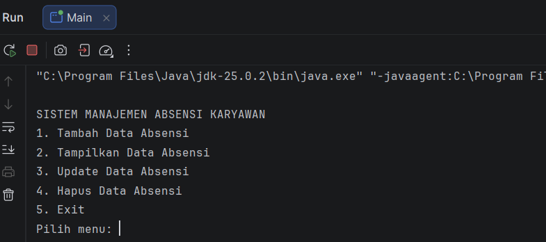
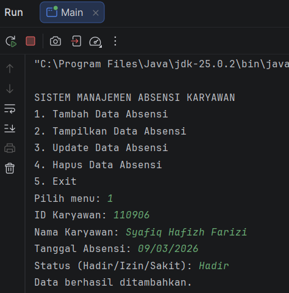
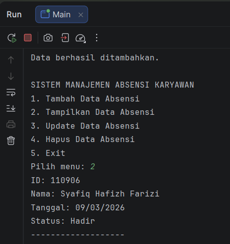
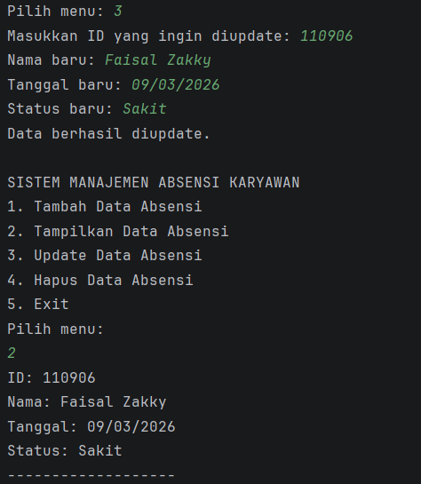
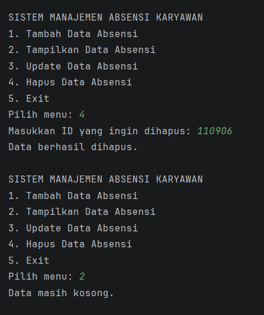

# Sistem Manajemen Absensi Karyawan

**Nama :** Syafiq Hafizh Farizi  
**NIM :** 2409106009  
**Kelas :** Pemrograman Berorientasi Objek A1'24  

---

## Deskripsi Program
Sistem Manajemen Absensi Karyawan adalah program berbasis **Java** yang saya buat menggunakan konsep **Pemrograman Berorientasi Objek (Object Oriented Programming / OOP)**.  

Program ini digunakan untuk mengelola data absensi karyawan dengan memanfaatkan **ArrayList** sebagai tempat penyimpanan data sementara dan Program memiliki fitur **CRUD (Create, Read, Update, Delete)** sehingga pengguna dapat menambahkan, melihat, mengubah, dan menghapus data absensi karyawan melalui menu yang tersedia.

---

# Fitur Program

## Menu Utama

Menu utama merupakan tampilan awal program yang berisi beberapa pilihan fitur yang dapat digunakan oleh pengguna.

Pilihan menu yang tersedia yaitu:
- Tambah Data Absensi
- Tampilkan Data Absensi
- Update Data Absensi
- Hapus Data Absensi
- Exit Program

Program akan terus berjalan hingga pengguna memilih menu **Exit**.

---

## 1. Tambah Data Absensi (Create)

Fitur ini digunakan untuk menambahkan data absensi karyawan ke dalam sistem.

Data yang dapat dimasukkan antara lain:
- ID Karyawan
- Nama Karyawan
- Tanggal Absensi
- Status Kehadiran (Hadir, Izin, atau Sakit)

Data yang telah dimasukkan akan disimpan ke dalam **ArrayList**.

---

## 2. Tampilkan Data Absensi (Read)

Fitur ini digunakan untuk menampilkan seluruh data absensi karyawan yang telah tersimpan dalam sistem.

Informasi yang ditampilkan meliputi:
- ID Karyawan
- Nama Karyawan
- Tanggal Absensi
- Status Kehadiran

Jika belum ada data yang dimasukkan, maka sistem akan menampilkan pesan bahwa data masih kosong.

---

## 3. Update Data Absensi (Update)

Fitur ini digunakan untuk memperbarui data absensi karyawan yang sudah ada.

Pengguna akan diminta memasukkan **ID karyawan** yang ingin diperbarui.  
Jika ID ditemukan, maka pengguna dapat mengubah:
- Nama karyawan
- Tanggal absensi
- Status kehadiran

Jika ID tidak ditemukan, sistem akan menampilkan pesan bahwa data tidak tersedia.

---

## 4. Hapus Data Absensi (Delete)

Fitur ini digunakan untuk menghapus data absensi karyawan dari sistem.

Pengguna diminta memasukkan **ID karyawan** yang ingin dihapus.  
Jika ID ditemukan, maka data tersebut akan dihapus dari **ArrayList**.

---