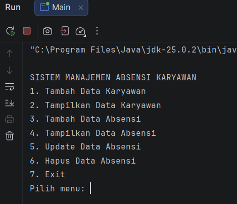
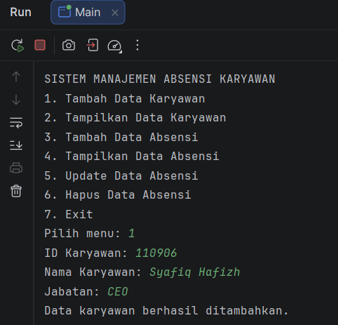
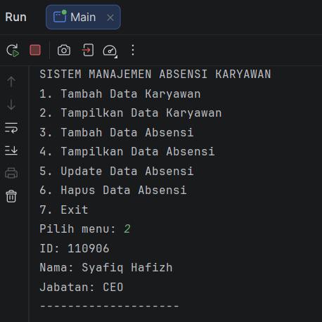
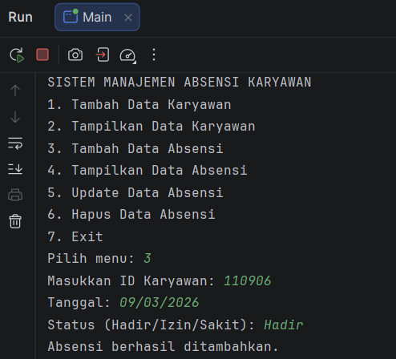
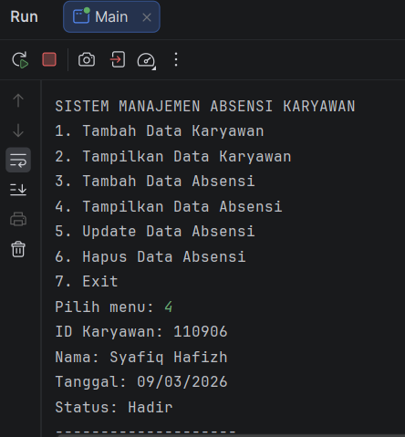
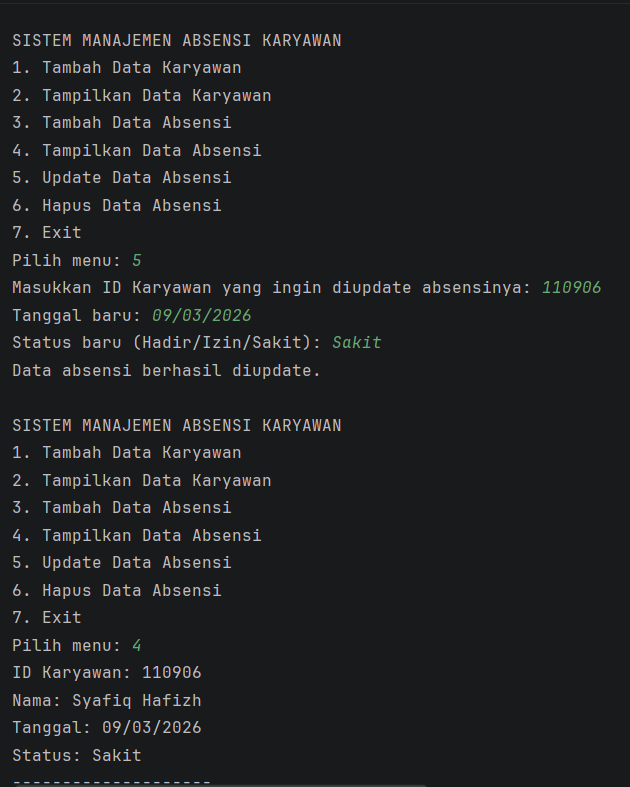
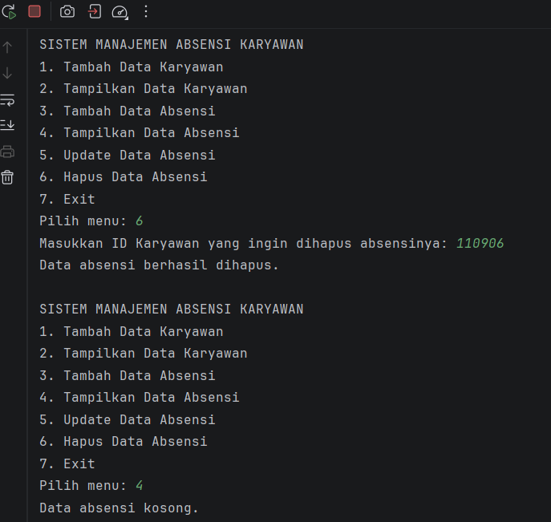

# Sistem Manajemen Absensi Karyawan

**Nama :** Syafiq Hafizh Farizi  
**NIM :** 2409106009  
**Kelas :** Pemrograman Berorientasi Objek A1'24  

---

# Deskripsi Program

Sistem Manajemen Absensi Karyawan adalah program berbasis **Java** yang dibuat menggunakan konsep **Pemrograman Berorientasi Objek (Object Oriented Programming / OOP)** dan Program ini digunakan untuk mengelola data **karyawan** dan **absensi karyawan** dengan memanfaatkan **ArrayList** sebagai tempat penyimpanan data sementara selama program berjalan.

Program ini memiliki fitur **CRUD (Create, Read, Update, Delete)** pada data absensi sehingga pengguna dapat menambahkan, melihat, mengubah, dan menghapus data melalui menu yang tersedia.

Dalam program ini terdapat beberapa class yaitu:

- **Karyawan** untuk menyimpan data karyawan  
- **AbsensiKaryawan** untuk menyimpan data absensi karyawan  
- **Main** untuk mengatur jalannya program dan menu sistem  

---

# Struktur Class

Program ini memiliki tiga class utama:

### 1. Class Karyawan
Class ini digunakan untuk menyimpan informasi mengenai karyawan.

Data yang disimpan meliputi:
- ID Karyawan
- Nama Karyawan
- Jabatan

### 2. Class AbsensiKaryawan
Class ini digunakan untuk menyimpan data absensi karyawan.

Data yang disimpan meliputi:
- Data Karyawan
- Tanggal Absensi
- Status Kehadiran (Hadir, Izin, atau Sakit)

### 3. Class Main
Class ini merupakan class utama yang berisi:
- Menu program
- Proses input data
- Penyimpanan data menggunakan **ArrayList**
- Logika CRUD program

---

# Fitur Program

## Menu Utama

Menu utama merupakan tampilan awal program yang berisi beberapa pilihan fitur yang dapat digunakan oleh pengguna.

Pilihan menu yang tersedia yaitu:

1. Tambah Data Karyawan  
2. Tampilkan Data Karyawan  
3. Tambah Data Absensi  
4. Tampilkan Data Absensi  
5. Update Data Absensi  
6. Hapus Data Absensi  
7. Exit Program  

Program akan terus berjalan hingga pengguna memilih menu **Exit**.

---

# 1. Tambah Data Karyawan

Fitur ini digunakan untuk menambahkan data karyawan ke dalam sistem.

Data yang dimasukkan meliputi:
- ID Karyawan
- Nama Karyawan
- Jabatan

Data yang telah dimasukkan akan disimpan ke dalam **ArrayList daftarKaryawan**.

---

# 2. Tampilkan Data Karyawan

Fitur ini digunakan untuk menampilkan seluruh data karyawan yang telah tersimpan dalam sistem.

Informasi yang ditampilkan meliputi:
- ID Karyawan
- Nama Karyawan
- Jabatan

Jika belum ada data yang dimasukkan, maka sistem akan menampilkan pesan bahwa data masih kosong.

---

# 3. Tambah Data Absensi

Fitur ini digunakan untuk menambahkan data absensi karyawan.

Pengguna diminta memasukkan:
- ID Karyawan
- Tanggal Absensi
- Status Kehadiran (Hadir / Izin / Sakit)

Program akan mencari **ID Karyawan** pada daftar karyawan.  
Jika ID ditemukan maka data absensi akan disimpan ke dalam **ArrayList dataAbsensi**.

---

# 4. Tampilkan Data Absensi

Fitur ini digunakan untuk menampilkan seluruh data absensi karyawan yang telah tersimpan dalam sistem.

Informasi yang ditampilkan meliputi:
- ID Karyawan
- Nama Karyawan
- Tanggal Absensi
- Status Kehadiran

Jika belum ada data absensi yang dimasukkan, maka sistem akan menampilkan pesan bahwa data masih kosong.

---

# 5. Update Data Absensi

Fitur ini digunakan untuk memperbarui data absensi karyawan yang sudah tersimpan.

Pengguna diminta memasukkan **ID Karyawan** yang ingin diperbarui data absensinya.

Jika ID ditemukan, pengguna dapat mengubah:
- Tanggal Absensi
- Status Kehadiran

Jika ID tidak ditemukan, maka sistem akan menampilkan pesan bahwa data tidak tersedia.

---

# 6. Hapus Data Absensi

Fitur ini digunakan untuk menghapus data absensi karyawan dari sistem.

Pengguna diminta memasukkan **ID Karyawan** yang ingin dihapus data absensinya.

Jika ID ditemukan, maka data tersebut akan dihapus dari **ArrayList dataAbsensi**.